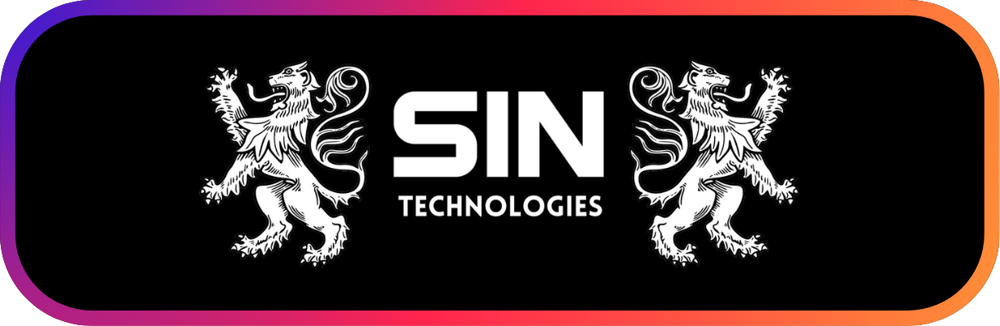

<!-- ╔══════════════════════════════════════════════════════════════╗
     ║   GitHub Profile README — Er. Harshvardhan Purohit             ║
     ║   Handle: Harshvardhan1609  ·  Brand: Maroon #7A1F2B / Gold    ║
     ╚══════════════════════════════════════════════════════════════╝ -->

<!-- ░░░░░░░░░░░░  ANIMATED HEADER WAVE  ░░░░░░░░░░░░ -->
<p align="center">
  
</p>

<!-- ░░░░░░░░░░░░  BRAND LOGOS  ░░░░░░░░░░░░ -->
<p align="center">
  
  &nbsp;&nbsp;&nbsp;&nbsp;&nbsp;&nbsp;
  
</p>

<!-- ░░░░░░░░░░░░  TYPING ANIMATION  ░░░░░░░░░░░░ -->
<p align="center">
  <a href="https://github.com/Harshvardhan1609">
    
  </a>
</p>

<!-- ░░░░░░░░░░░░  CREDENTIAL BADGES  ░░░░░░░░░░░░ -->
<p align="center">
  
  
  
  
</p>

<p align="center">
  
  <a href="https://github.com/Harshvardhan1609?tab=followers">
    
  </a>
</p>

<!-- ░░░░░░░░░░░░  DIVIDER  ░░░░░░░░░░░░ -->


## 🚀 About Me

```python
class Harshvardhan:
    def __init__(self):
        self.role        = "Founder and CEO @ SIN Technologies"
        self.location    = "Jodhpur, Rajasthan, India 🇮🇳"
        self.education   = ["B.Tech AI-ML (Gold Medal, Rank #1 BTU)", "MBA (CGPA 9.42)"]
        self.recognition = "PM Shri National AI Expert"
        self.mission     = "Make India a global leader in AI, EdTech and XR"

    def current_focus(self):
        return [
            "🧠 SIN School of AI curriculum (RAG · GenAI · Agentic AI)",
            "🥽 Trilok XR Universe (Ramayan / Mahabharat / Vrindavan)",
            "🎙️ SIN Cinematic TTS Engine",
            "🎓 SIN Campus Ambassadors 2026 — 20+ campuses",
        ]

    def philosophy(self):
        return "Built in India, for the world. 🪔"
```


## 🏛️ What I'm Building — SIN Technologies

<p align="center">
  
</p>

> *A DPIIT-registered, ISO 9001:2015-certified AI and EdTech startup operating across six verticals.*

| Vertical | What It Does |
|----------|--------------|
| 🎓 **SIN School of AI** | Industry-grade AI education — RAG, GenAI and Agentic AI specializations |
| 🎨 **SIN Brand Studio** | AI-powered brand transformation and content for D2C brands |
| 🥽 **SIN Mixed Reality Studio** | AR/VR/VFX experiences — the *Trilok XR Universe* |
| 📊 **SIN Data Studio** | Data intelligence and analytics solutions |
| ⚙️ **Industra ERP** | No-code business management suite |
| 🧭 **Xcellence Board** | Career Intelligence DNA and campus placement platform |


## 🛠️ Tech Stack

<p align="center">
  <strong>Languages</strong><br/>
  
</p>

<p align="center">
  <strong>Frameworks and Libraries</strong><br/>
  
</p>

<p align="center">
  <strong>AI / ML and Cloud</strong><br/>
  
</p>


## 📊 GitHub Stats

<p align="center">
  
  
</p>

<p align="center">
  
</p>

<p align="center">
  
</p>

<!-- Snake animation (requires snake.yml workflow — see setup note) -->
<p align="center">
  
</p>


## 🌟 Featured Projects

<p align="center">

| Project | Description | Live |
|---------|-------------|:----:|
| 🤖 **Darbar** | Multi-agent AI chat — 7 historical-figure agents (React · Supabase · Gemini) | — |
| 📔 **AI Diary** | Social journaling app with a Digital Vault | [Visit](https://aidiaryindia.netlify.app) |
| 🧭 **Orbit LMS** | Modern learning management system | [Visit](https://orbitlms.netlify.app) |
| 🏆 **Xcellence Board** | Career intelligence and placement platform | [Visit](https://xcellenceboard.com) |

</p>


## 🤝 Connect With Me

<p align="center">
  <a href="https://www.linkedin.com/in/harshvardhan1609/"></a>
  <a href="https://xcellenceboard.com"></a>
  <a href="mailto:your@email.com"></a>
</p>

<!-- ░░░░░░░░░░░░  ANIMATED FOOTER WAVE  ░░░░░░░░░░░░ -->
<p align="center">
  
</p>
